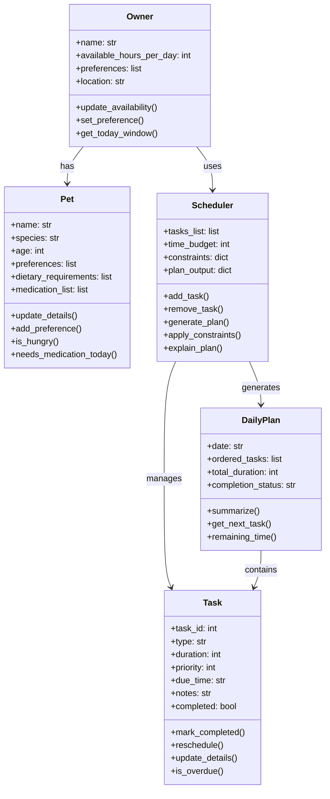

# PawPal+ Project Reflection

## 1. System Design

### 1d. Building Blocks (main objects)

- Pet
  - Attributes: name, species, age, preferences, dietary requirements, medication list
  - Methods: update_details(), add_preference(), is_hungry(), needs_medication_today()

- Owner
  - Attributes: name, available_hours_per_day, preferences, location
  - Methods: update_availability(), set_preference(), get_today_window()

- Task
  - Attributes: task_id, type (walk/feed/med/enrichment/groom), duration, priority, due_time, notes, completed
  - Methods: mark_completed(), reschedule(), update_details(), is_overdue()

- Scheduler (or Planner)
  - Attributes: tasks_list, time_budget, constraints, plan_output
  - Methods: add_task(), remove_task(), generate_plan(), apply_constraints(), explain_plan()

- DailyPlan (optional)
  - Attributes: date, ordered_tasks, total_duration, completion_status
  - Methods: summarize(), get_next_task(), remaining_time()

**a. Initial design**

The initial UML design uses a class diagram to model the PawPal+ system with five main classes: Owner, Pet, Task, Scheduler, and DailyPlan. The Owner class represents the pet owner and manages their availability and preferences. The Pet class holds information about the pet's details and needs. The Task class defines individual care tasks with attributes like type, duration, and priority. The Scheduler class handles the logic for generating daily plans based on tasks and constraints. The DailyPlan class represents the output schedule for a day. Relationships include Owner having Pets, Scheduler managing Tasks and generating DailyPlans, and DailyPlans containing Tasks.

What classes did you include, and what responsibilities did you assign to each?

- **Owner**: Manages owner information and preferences; provides methods for updating availability and getting time windows.
- **Pet**: Stores pet details and needs; includes methods for updating info and checking status like hunger or medication needs.
- **Task**: Represents care tasks; handles completion, rescheduling, and status checks.
- **Scheduler**: Core logic for planning; adds/removes tasks, generates plans, applies constraints, and explains decisions.
- **DailyPlan**: Output of the scheduler; summarizes the day's tasks and tracks progress.

**b. Design changes**

Several design changes were made after the initial UML draft. The biggest update was moving from a very simple task model to a richer `Task` object with `description`, `frequency`, `due_date`, and helper methods for recurrence. I also shifted more responsibility into `Scheduler`, adding sorting, filtering, recurring-task handling, and conflict detection so the planning rules lived in one place instead of being scattered across the UI or demo script. Those changes made the final system more realistic and closer to how a real planning app would separate data from decision logic.

The final UML was updated to reflect those changes and saved as `uml_final.svg` in the project folder.

**c. Core actions**

- **Track Pet Care Tasks**: The app should allow users to track various pet care tasks such as walks, feeding, medication, enrichment activities, and grooming. This feature will help pet owners stay organized and ensure that all necessary tasks are completed on time.
- **Consider Constraints**: The app should take into account the user's available time, task priority, and personal preferences when suggesting a daily care plan. This ensures that the recommendations are tailored to the user's specific situation.
- **Produce a Daily Plan**: The app should generate a daily plan for pet care tasks and provide explanations for the chosen tasks. This feature will help users understand the reasoning behind the recommendations and improve their adherence to the care schedule.

---

## 2. Scheduling Logic and Tradeoffs

**a. Constraints and priorities**

The scheduler considers the owner's daily time budget, task due date and due time, task priority, recurrence, and basic conflict visibility. It first sorts tasks into a sensible chronological order and then trims the plan so it still fits into the owner's available time. I treated time feasibility as the most important constraint because a schedule that cannot fit into the day is not useful, and then used priority so essential care like feeding or medication stays ahead of optional tasks.

**b. Tradeoffs**

The scheduler uses lightweight conflict detection that only flags exact matches on date and start time instead of calculating overlapping durations. That tradeoff keeps the logic easier to read and debug for this project, even though it means a task at 8:00 for 30 minutes and another at 8:15 would not be treated as a conflict yet.

---

## 3. AI Collaboration

**a. How you used AI**

I used AI most heavily for implementation planning, method design, and test brainstorming. Copilot-style prompts were especially helpful when I wanted to translate a general goal into a concrete Python pattern, such as sorting `HH:MM` strings with a lambda key, deciding where recurrence logic should live, or thinking through lightweight conflict detection. The most useful prompts were short and specific, for example asking how a scheduler should retrieve tasks from an owner's pets or what edge cases mattered most for recurring tasks and sorting.

**b. Judgment and verification**

One example of human judgment came up during the algorithmic phase. A more advanced approach would have been to detect overlapping task durations rather than only exact time conflicts, but I intentionally kept the simpler exact-match warning because it was easier to explain, test, and maintain for this project. I evaluated suggestions by checking whether they made the code clearer, whether they matched the assignment scope, and whether I could verify them with `main.py` output or automated pytest checks before keeping them.

---

## 4. Testing and Verification

**a. What you tested**

I tested task completion, task addition, chronological sorting, filtering by pet and status, recurring daily task creation, empty schedules, exact-time conflict detection, and no-conflict cases. These tests matter because they cover both the basic happy path and the core "smart" behaviors that make the scheduler useful, especially sorting and recurrence.

**b. Confidence**

My confidence level is 4 out of 5. The current test suite gives me strong confidence in the main backend behaviors, and the Streamlit app now exposes those same features clearly. If I had more time, I would add tests for invalid time formats, overlapping-duration conflicts, and more UI-driven workflows to increase confidence even further.

---

## 5. Reflection

**a. What went well**

I am most satisfied with the way the project evolved from a simple UML sketch into a small but coherent system. The backend classes, CLI demo, tests, and Streamlit interface now reinforce each other instead of feeling like disconnected pieces.

**b. What you would improve**

With another iteration, I would improve the conflict detection so it understands overlapping durations instead of only exact matches, and I would make the UI support editing or deleting tasks directly. I would also make the schedule explanation richer so the app could better justify why some tasks were included and others were left out.

**c. Key takeaway**

My biggest takeaway is that AI works best as a fast design and coding assistant, not as the final architect. The project stayed organized because I kept deciding the structure, checking whether suggestions matched the scope, and using separate phase-based workflows to keep each step focused instead of letting the implementation drift.

**d. AI strategy**

The most effective Copilot-style features for this project were quick method scaffolding, targeted debugging help, and test generation prompts. One AI suggestion I effectively rejected was the temptation to make the scheduler more complex than the assignment required; I kept the design cleaner by choosing readable, lightweight algorithms over maximum cleverness. Using separate chat sessions or phase-based work helped me stay organized because each phase had its own goal: design, implementation, integration, algorithms, testing, and polish. That separation made it easier to act as the lead architect, since I could evaluate AI suggestions within the context of one clear milestone instead of mixing every problem together at once.
